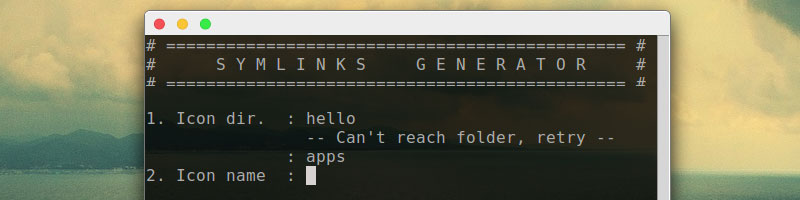

#Symlinks Generator



I originally created this to help [fsvh](https://github.com/fsvh) making it's
[Captiva Icon Theme](https://github.com/captiva-project/captiva-icon-theme).
Symlinks Generator script prompts the user for the icon he wants to create
symlinks, and then create symlinks in the specified directory for every
dimensions (16, 24...).


###Use
```
git clone git@github.com:maloblanchard/symlinks-generator.git
cd symlinks-generator/
# Change the value for "DIR" in the script
bash symlinks-generator.sh
```


###Requirements
Your icon folder tree has to respect this structure (example):
```
├── YourThemeFolder
│   ├── 16x16
│   │   ├── apps
│   │   │   ├── terminator.png
│   │   │   └── ...
│   │   ├── web
│   │   │   ├── firefox.png
│   │   │   └── ...
│   │   └── ...
│   ├── 64
│   │   ├── apps
│   │   │   ├── terminator.png
│   │   │   └── ...
│   │   ├── web
│   │   │   ├── firefox.png
│   │   │   └── ...
│   │   └── ...
│   └── ...
```


###Ideas, Bugs
Don't hesitate to [contact me](http://maloblanchard.com/contact).


###Changelog
```
v2.6 (2014-11-07)
 - New version, working with bash instead of sh
v2.5 (2014-08-19)
 - Complete rewrite of the code
 - The script now checks if variables are empty
 - More understandable variables names
v2.4 (2014-08-16)
 - New interface
 - [Fix] bad symlink path
```
